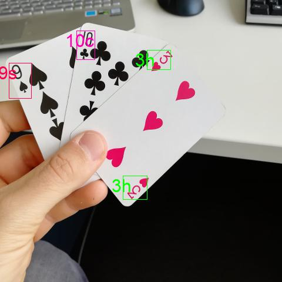
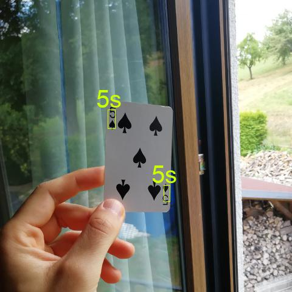

Playing card detection and classification toolkit.

## Main Objectives

- **Create a general dataset** of a standard, 52-card deck of playing cards  in different poses, brightness situations and blurring levels annotated with bounding boxes around the ranks and suits and corresponding class information.
- **Train an object detection algorithm** on these synthesized data that performs bounding box localization and regression for classification. In particular, we train  the latest iteration of the YOLO object detection algorithm end-to-end.
- **Evaluate the algorithm on a hold-out validation dataset** covering all classes. As a performance metric, mean Average Precision (mAP) is used.
- **Deploy the model on a camera** as a proof of concept.

## Examples

## Usage & Requirements
See report & poster to get a deeper understanding of this project.
