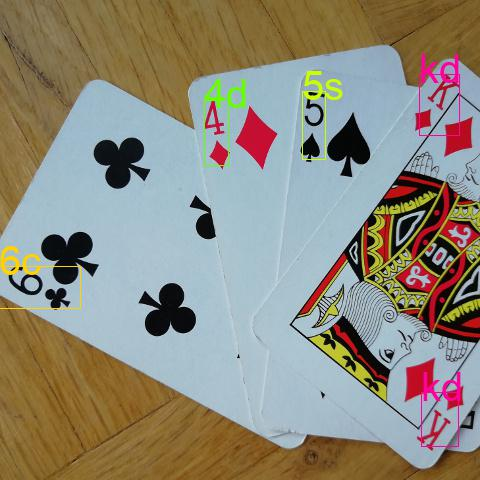

Playing card detection and classification toolkit.

## Main Objectives

- **Create a general dataset** of a standard, 52-card deck of playing cards  in different poses, brightness situations and blurring levels annotated with bounding boxes around the ranks and suits and corresponding class information.
- **Train an object detection algorithm** on these synthesized data that performs bounding box localization and regression for classification. In particular, we train  the latest iteration of the YOLO object detection algorithm end-to-end.
- **Evaluate the algorithm on a hold-out validation dataset** covering all classes. As a performance metric, mean Average Precision (mAP) is used.
- **Deploy the model on a camera** as a proof of concept.

## Examples

# Data Creation
Please follow this instructions for your data creation.
For a deeper understanding, please consult the report & poster.

## External dependencies & Usage
To use this programs, you will first have to download the 
Describable Textures Dataset (DTD) (https://www.robots.ox.ac.uk/~vgg/data/dtd/) and 
untar it in the data directory.
You will then have a dtd-r1.0.1 on your data directory.

The following python packages are also required:
- six
- numpy
- scipy
- scikit-image 
- OpenCV
- imgaug (https://github.com/aleju/imgaug)

## Dataset Creation
There are two scripts that will lead you to your data creation.

- paste_canvas.py: randomly blur, change the lighting and sharpening of the cards and 
  finally pasted them on different textures.
- generate_data.py: Perform linear transformations on the images on canvases and after this
  crop the image into the middle.

It is necessary to run the first script after the next one.
You can not run generate_data.py without having created data using paste_canvas.py.

## paste_canvas.py
This script randomly blur the cards using Gaussian, Average and Median filters.
It also randomly performs sharping and lighting operations on the images. 
After doing this, the cards are pasted in the middle of 3000x3000 pixels scaled canvases provided by 
Describable Textures Dataset (DTD) (https://www.robots.ox.ac.uk/~vgg/data/dtd/)

### USAGE:

-python paste_canvas.py:  Generate new data using 5 images over 15 directories of dtd-r1.0.1.
-python paste_canvas.py Nr_images Nr_directories:  Generate new data using Nr_images over Nr_directories of dtd-r1.0.1. 

The generated data is saved on data/textures/images & data/textures/np_convex

## generate_data.py
This script randomly perform linear transformations on the images on canvases.
Concluding this, the images are crp to the middle, reducing their pixel resolution by 800x800 pixels.

### USAGE:
python generate_data.py: Generate new data using 5 transformations on each image (Ploting the result is 'off' by default).

-python generate_data.py Nr_transformations: Generate new data using Nr_transformations transformations on each image (Ploting the result is 'off' by default). 

-python generate_data.py Nr_transformations PLOT: Generate new data using Nr_transformations transformations on each image (Ploting the result is depends on PLOT, where PLOT is 'True' or 'False'). 

The generated data is saved on YOLO/JPEGImages & YOLO/labels

# YOLO training

## External dependencies & Usage

The code, especially the YOLO architecture, is based on the implementation of https://github.com/marvis/pytorch-yolo3 for normal-YOLOv3 training on VOC data. We had to adapt large parts of the code to work on pytorch 0.4, our cards data and tiny YOLOv3.

The following python packages are required:
- Python 3.6
- pytorch 0.4
- CUDA 5.2 or newer
- Python OpenCV (CV2) for webcam and predictions
### USAGE:
Navigate to the YOLO folder.
For training, you need to create a dataset from the above pipeline and have it within cards_data/JPEGImages and cards_data/labels. For testing, none of this is required.

## Training:
Before anything, the folder cards_data/JPEGImages needs to contain images and cards_data/labels needs to contain corresponding labels from the above data creation pipeline.

Before running YOLO, we have to know what to train/test on. We need to write absolute paths into the files cardstrain.txt and cardsval.txt, that's what we will do next.
touch cards_data/cardstrain.txt
touch cards_data/cardsval.txt 
python cards_data/prepare_trainlist.py  **this will create a list of absolute paths of images that we can train / test on and write it in cardstrain.txt**

Now, we are ready to use the model:

**Train YOLO on the data, starting with our weights vector**

python train.py -d cards_data/cards.data -c cards_data/yolov3-tiny.cfg -w hardest.weights

## Testing:
**Detect a single image given a weights file (given in the 3rd argument, e.g. data/fail.jpg or data/test11.jpg)** The prediction will be put in the top level folder

python detect.py cards_data/yolov3-tiny.cfg backup/hardest.weights data/fail.jpg cards_data/cards.names

**Use the webcam for prediction given a weights file** The prediction will be put in the top level folder

python webcam.py cards_data/yolov3-tiny.cfg backup/hardest.weights data/train3.jpg cards_data/cards.names

## Generally:

**cards.data** specifies where to look for class / label mappings, folder of cardstrain.txt and cardsval.txt

**hardest.weights** specifies which weight to start training with

**yolov3-tiny.cfg** specifies the network architecture - and needs to correspond to the .weight file
