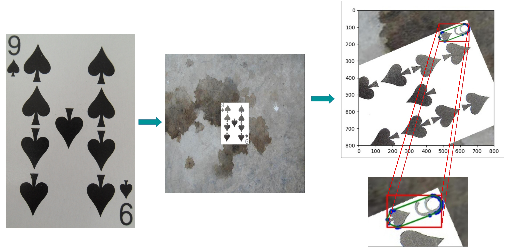

Playing card detection and classification toolkit

## Dataset Creation
Create your own card dataset.
- Use paste_canvas.py to perform blurring, sharpening, change of lighting to
  the cards and paste on convas.
- Use generate_data to perform rotations, translations and cropping of the
  image.

