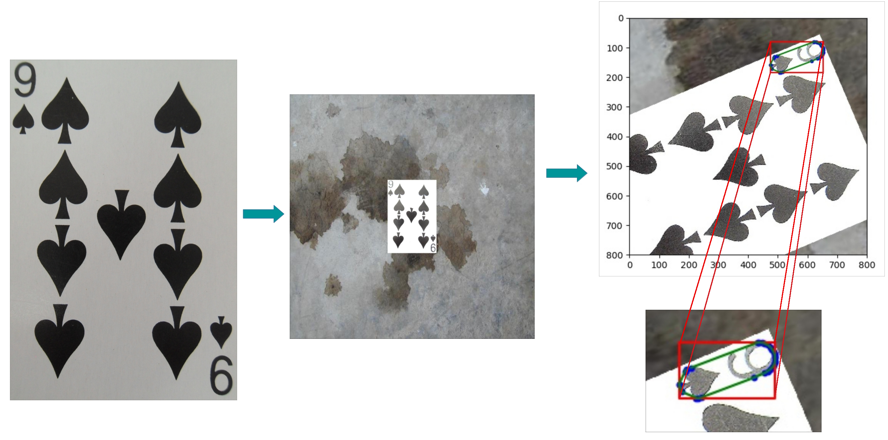

# README: source
Please follow this instructions for your data creation.
For a deeper understanding, please consult the report & poster.

## External dependencies & Usage
To use this programs, you will first have to download the 
Describable Textures Dataset (DTD) (https://www.robots.ox.ac.uk/~vgg/data/dtd/) and 
untar it in the data directory.
You will then have a dtd-r1.0.1 on your data directory.

The following python packages are also required:
- six
- numpy
- scipy
- scikit-image 
- OpenCV
- imgaug (https://github.com/aleju/imgaug)

## Dataset Creation
There are two scripts that will lead you to your data creation.

- paste_canvas.py: randomly blur, change the lighting and sharpening of the cards and 
  finally pasted them on different textures.
- generate_data.py: Perform linear transformations on the images on canvases and after this
  crop the image into the middle.

It is necessary to run the first script after the next one.
You can not run generate_data.py without having created data using paste_canvas.py.

## paste_canvas.py
This script randomly blur the cards using Gaussian, Average and Median filters.
It also randomly performs sharping and lighting operations on the images. 
After doing this, the cards are pasted in the middle of 3000x3000 pixels scaled canvases provided by 
Describable Textures Dataset (DTD) (https://www.robots.ox.ac.uk/~vgg/data/dtd/)

### USAGE:

- python paste_canvas.py:  Generate new data using 5 images over 15 directories of dtd-r1.0.1.

- python paste_canvas.py Nr_images Nr_directories:  Generate new data using Nr_images over Nr_directories of dtd-r1.0.1. 

Example: python paste_canvas.py 5 2 -> generates images using 2 directories and 5 images per directory.

The generated data is saved on data/textures/images & data/textures/np_convex

## generate_data.py
This script randomly perform linear transformations on the images on canvases.
Concluding this, the images are cropped into the middle, reducing their pixel resolution by 800x800 pixels.

### USAGE:

- python generate_data.py: Generate new data using 5 transformations on each image (Ploting the result is 'off' by default).

- python generate_data.py Nr_transformations: Generate new data using Nr_transformations transformations on each image (Ploting the result is 'off' by default). 

- python generate_data.py Nr_transformations PLOT: Generate new data using Nr_transformations transformations on each image (Ploting the result is depends on PLOT, where PLOT is 'True' or 'False'). 

Example: python generate_data.py 2 -> generates 2 images using different transformations and plots previous results

The generated data is saved on YOLO/cards_data/JPEGImages & YOLO/cards_data/labels
